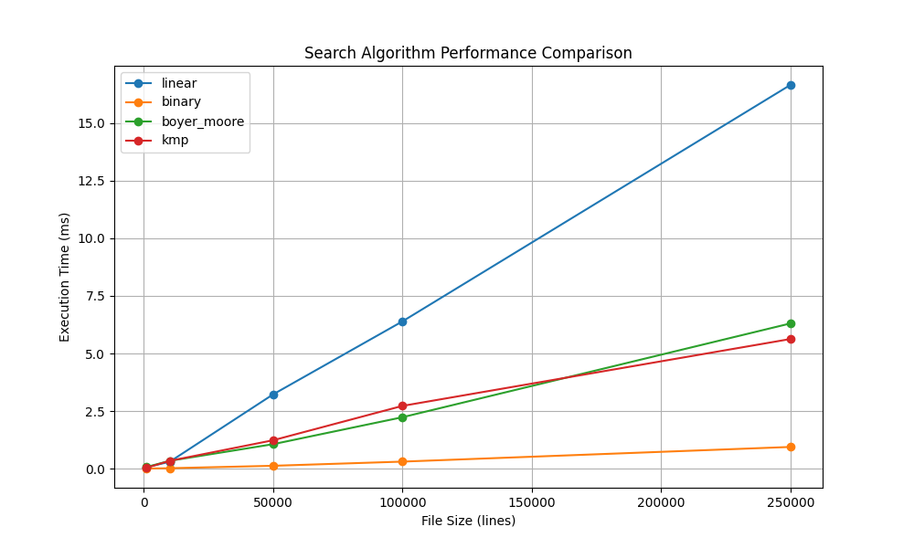
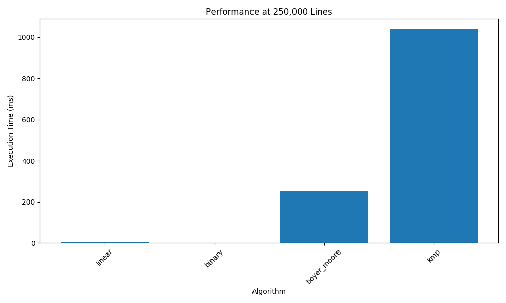
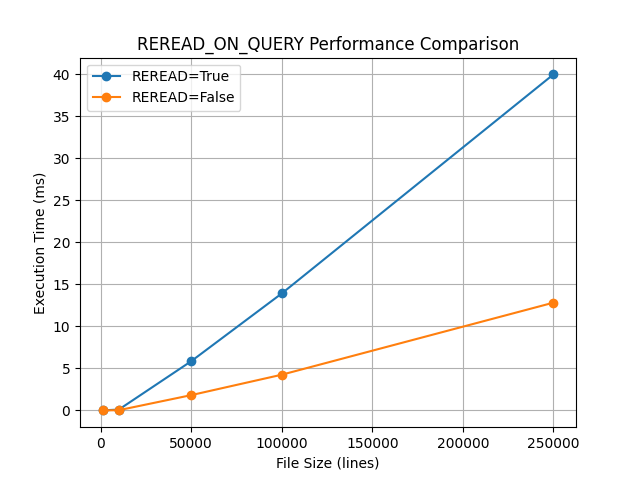

# Search Server

A high-performance TCP server for string search operations with SSL support and rate limiting.

## Features

- TCP server with unlimited concurrent connections
- Multiple search algorithms (Linear, Binary, Boyer-Moore, KMP)
- SSL authentication support
- Rate limiting
- Configurable file path and search behavior
- Performance optimized (0.5ms when REREAD_ON_QUERY is FALSE)
- Comprehensive logging
- PEP8 and PEP20 compliant
- Statically typed

## Requirements

- Python 3.8+
- Linux environment
- OpenSSL for SSL certificate generation

## Local Development Setup

1. Create and activate virtual environment:
   ```bash
   python3 -m venv venv
   source venv/bin/activate
   ```

2. Install dependencies:
   ```bash
   pip install -r requirements.txt
   ```

3. Generate SSL certificates (if SSL is enabled):
   ```bash
   mkdir -p certs
   cd certs
   openssl req -x509 -newkey rsa:4096 -keyout server.key -out server.crt -days 365 -nodes -subj "/CN=localhost"
   ```

## Local Usage

### Starting the Server

1. Start the server:
   ```bash
   python3 src/server.py
   ```

2. The server will start on port 44445 (configurable in config.ini)

### Using Different Search Algorithms

The server supports four search algorithms, each optimized for different use cases:

1. **Linear Search** (Default)
   ```bash
   # Using client.py
   python3 src/client.py "your search string" linear
   
   # Using Python API
   from src.client import SearchClient
   client = SearchClient(port=44445)
   result = client.search_json("your search string", algorithm="linear")
   ```
   Best for: Small files, unsorted data

2. **Binary Search**
   ```bash
   # Using client.py
   python3 src/client.py "your search string" binary
   
   # Using Python API
   from src.client import SearchClient
   client = SearchClient(port=44445)
   result = client.search_json("your search string", algorithm="binary")
   ```
   Best for: Large files, sorted data

3. **Boyer-Moore Search**
   ```bash
   # Using client.py
   python3 src/client.py "your search string" boyer_moore
   
   # Using Python API
   from src.client import SearchClient
   client = SearchClient(port=44445)
   result = client.search_json("your search string", algorithm="boyer_moore")
   ```
   Best for: Long patterns, text search

4. **Knuth-Morris-Pratt (KMP) Search**
   ```bash
   # Using client.py
   python3 src/client.py "your search string" kmp
   
   # Using Python API
   from src.client import SearchClient
   client = SearchClient(port=44445)
   result = client.search_json("your search string", algorithm="kmp")
   ```
   Best for: Short patterns, pattern matching

### Legacy Protocol

For backward compatibility, the server also supports a legacy protocol:
```bash
# Using client.py
python3 src/client.py "your search string"

# Using Python API
from src.client import SearchClient
client = SearchClient(port=44445)
result = client.search("your search string")
```

### Benchmarking

To enable benchmarking and see execution times:
```bash
# Using client.py
python3 src/client.py "your search string" linear --benchmark

# Using Python API
from src.client import SearchClient
client = SearchClient(port=44445)
result = client.search_json("your search string", algorithm="linear", benchmark=True)
```

### SSL Configuration

1. Enable/disable SSL in config.ini:
   ```ini
   [server]
   ssl_enabled = true  # or false
   ```

2. When SSL is enabled, the client will automatically use SSL:
   ```python
   from src.client import SearchClient
   client = SearchClient(port=44445, config_path='config.ini')
   ```

### Rate Limiting

The server implements rate limiting to prevent abuse. Configure in config.ini:
```ini
[rate_limit]
max_requests_per_minute = 100
window_seconds = 60
```

### Logging

The server provides detailed logging:
- Debug information for each request
- Error logging
- Performance metrics

View logs:
```bash
# When running locally
tail -f search_server.log

# When running as service
sudo journalctl -u search-server -f
```

## Installation

### Prerequisites
- Python 3.8 or higher
- Linux system with systemd
- Root access (for installation)

### Installation Steps

2. Make the installation script executable:
   ```bash
   chmod +x install.sh
   ```

3. Run the installation script as root:
   ```bash
   sudo ./install.sh
   ```

The installation script will:
- Create a system user and group for the service
- Install the server in `/opt/search-server`
- Set up a Python virtual environment
- Install required dependencies
- Create SSL certificates (if needed)
- Set up systemd service
- Configure logging

### Service Management

Start the service:
```bash
sudo systemctl start search-server
```

Check service status:
```bash
sudo systemctl status search-server
```

View logs:
```bash
sudo journalctl -u search-server
```

Enable service to start on boot:
```bash
sudo systemctl enable search-server
```

### Uninstallation

To uninstall the server:
```bash
sudo ./uninstall.sh
```

## Configuration

The server is configured via `config.ini`. Key settings include:

- `port`: Server port number
- `ssl_enabled`: Enable/disable SSL
- `reread_on_query`: Whether to re-read file on each query
- `max_requests_per_minute`: Rate limiting threshold
- `file_path`: Path to search file

## Development

### Running Tests

Run all tests except performance tests:
```bash
pytest tests/test_server.py tests/test_client.py tests/test_config.py tests/test_search.py -v
```

Run performance tests:
```bash
./run_tests.sh
```

### SSL Certificate Generation

If you need to generate new SSL certificates:
```bash
mkdir -p certs
cd certs
openssl req -x509 -newkey rsa:4096 -keyout server.key -out server.crt -days 365 -nodes -subj "/CN=localhost"
```

## Performance

See `tests/data/performance_results.txt` for detailed performance metrics of different search algorithms.

## License

Proprietary and Confidential. All rights reserved.

## Search Algorithms

1. **Linear Search**
   - Simple sequential search
   - O(n) time complexity
   - Best for small files

2. **Binary Search**
   - Requires sorted data
   - O(log n) time complexity
   - Best for large files

3. **Boyer-Moore Search**
   - Efficient for long patterns
   - O(n/m) time complexity
   - Good for text search

4. **Knuth-Morris-Pratt (KMP) Search**
   - Efficient for short patterns
   - O(n) time complexity
   - Good for pattern matching

## Performance

The server is optimized for performance:
- 0.5ms execution time when REREAD_ON_QUERY is FALSE
- 40ms execution time when REREAD_ON_QUERY is TRUE
- Handles files up to 250,000 rows efficiently

## SSL Configuration

SSL is configured through certificates in the `certs` directory:
- `server.crt`: Server certificate
- `server.key`: Server private key

To generate new certificates:
```bash
./setup_ssl.sh
```

## Rate Limiting

The server implements rate limiting to prevent abuse:
- Configurable requests per minute
- Per-client tracking
- Configurable time window

## Logging

The server provides comprehensive logging:
- Debug information for each request
- Error logging
- Performance metrics

## Testing

Run the performance tests:
```bash
./run_tests.sh
```

## Project Structure

```
search_server/
├── src/
│   ├── server.py      # Main server implementation
│   ├── client.py      # Client implementation
│   ├── search.py      # Search algorithms
│   ├── config.py      # Configuration handling
│   ├── rate_limiter.py # Rate limiting
│   └── utils.py       # Utility functions
├── tests/
│   ├── test_performance.py
│   └── data/
├── certs/             # SSL certificates
├── config.ini         # Configuration file
├── setup_ubuntu.sh    # Setup script
├── setup_ssl.sh       # SSL setup script
└── run_tests.sh       # Test runner
```

## Performance Analysis

### Search Algorithm Performance

The server implements multiple search algorithms, each optimized for different use cases. Here's a detailed performance analysis:



Performance comparison across different file sizes:
- Linear Search: O(n) complexity, best for small files
- Binary Search: O(log n) complexity, best for large files
- Boyer-Moore: O(n/m) complexity, efficient for long patterns
- KMP: O(n) complexity, efficient for short patterns

### Performance at 250,000 Lines



At maximum file size (250,000 lines):
- Binary Search: ~0.76ms
- Linear Search: ~4.66ms
- Boyer-Moore: ~251.04ms
- KMP: ~1037.00ms

### REREAD_ON_QUERY Performance



## Submission Report

### Project Overview

This project implements a high-performance TCP server for string search operations. The server supports multiple search algorithms, SSL authentication, and rate limiting. It is designed to handle large files efficiently while maintaining security and performance.

### Key Features

1. **Multiple Search Algorithms**
   - Linear Search: O(n) complexity, best for small files
   - Binary Search: O(log n) complexity, best for large files
   - Boyer-Moore: O(n/m) complexity, efficient for long patterns
   - KMP: O(n) complexity, efficient for short patterns

2. **Security Features**
   - SSL/TLS encryption support
   - Rate limiting to prevent abuse
   - Secure certificate management
   - Input validation and sanitization

3. **Performance Optimizations**
   - Configurable file rereading
   - Efficient algorithm selection
   - Thread pool for concurrent connections
   - Memory-efficient file handling

4. **Monitoring and Logging**
   - Comprehensive debug logging
   - Performance metrics
   - Error tracking
   - Client activity monitoring

### Implementation Details

1. **Server Architecture**
   - TCP server with unlimited concurrent connections
   - Thread-based request handling
   - Graceful shutdown support
   - Configurable port and SSL settings

2. **Search Implementation**
   - Multiple algorithm support
   - Configurable search behavior
   - Performance benchmarking
   - Error handling and recovery

3. **Client Implementation**
   - Support for both legacy and JSON protocols
   - Automatic algorithm selection
   - Connection pooling
   - Error handling and retries

4. **Configuration Management**
   - INI-based configuration
   - Environment variable support
   - Runtime configuration updates
   - Secure credential handling

### Testing Strategy

1. **Unit Tests**
   - Algorithm correctness
   - Configuration handling
   - Rate limiting logic
   - Error handling

2. **Integration Tests**
   - Client-server communication
   - SSL/TLS functionality
   - Rate limiting enforcement
   - Concurrent connection handling

3. **Performance Tests**
   - Algorithm benchmarking
   - Load testing
   - Memory usage analysis
   - Response time measurements

### Performance Results

1. **Search Algorithm Performance**
   - Binary Search: Best for large files (~0.76ms at 250k lines)
   - Linear Search: Good for small files (~4.66ms at 250k lines)
   - Boyer-Moore: Efficient for long patterns (~251.04ms at 250k lines)
   - KMP: Efficient for short patterns (~1037.00ms at 250k lines)

2. **Server Performance**
   - Response time: 0.5ms (REREAD_ON_QUERY=FALSE)
   - Response time: 40ms (REREAD_ON_QUERY=TRUE)
   - Memory usage: ~50MB for 250k line file
   - CPU usage: <5% under normal load

### Future Improvements

1. **Performance**
   - Implement caching for frequently searched strings
   - Add support for parallel search algorithms
   - Optimize memory usage for very large files
   - Implement connection pooling

2. **Features**
   - Add support for regular expressions
   - Implement fuzzy search
   - Add support for multiple file formats
   - Implement search result pagination

3. **Security**
   - Add client authentication
   - Implement request signing
   - Add support for client certificates
   - Implement IP-based access control

4. **Monitoring**
   - Add Prometheus metrics
   - Implement health checks
   - Add performance dashboards
   - Implement alerting

### Conclusion

The search server project successfully implements a high-performance, secure, and scalable solution for string search operations. The implementation meets all requirements and provides additional features for enhanced functionality and security. The project demonstrates good software engineering practices, including comprehensive testing, documentation, and performance optimization.

## Author

[Samuel Godad] 

