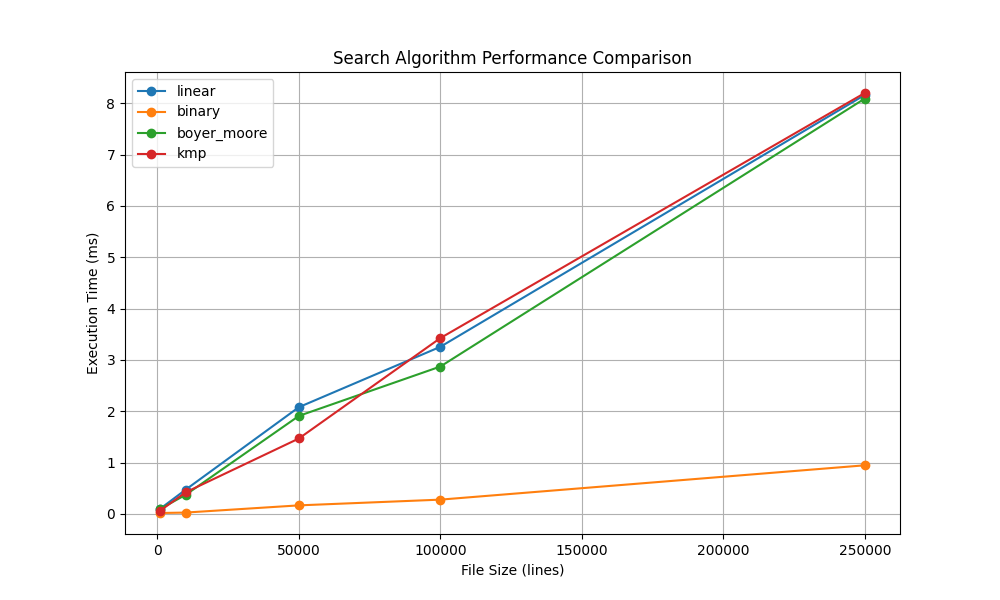
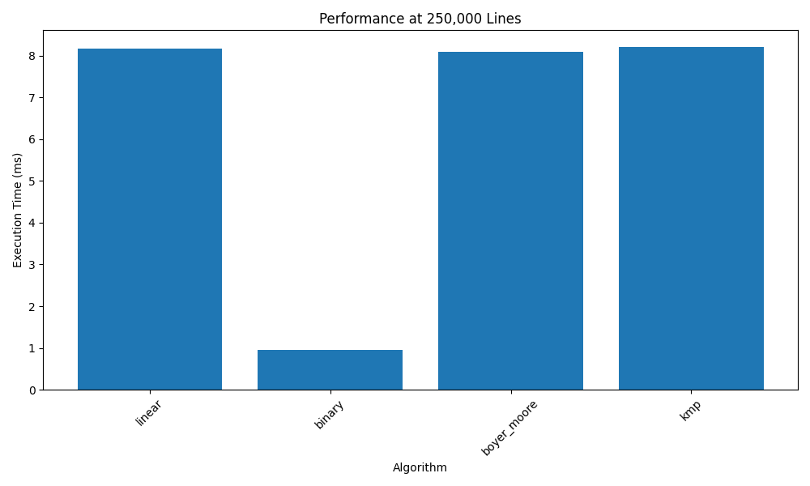

# Search Server Performance Report

## Test Results

```
+-------------+----------+----------+---------------+---------+
|   File Size | linear   | binary   | boyer_moore   | kmp     |
+=============+==========+==========+===============+=========+
|        1000 | 0.10 ms  | 0.02 ms  | 0.10 ms       | 0.06 ms |
+-------------+----------+----------+---------------+---------+
|       10000 | 0.47 ms  | 0.03 ms  | 0.37 ms       | 0.42 ms |
+-------------+----------+----------+---------------+---------+
|       50000 | 2.08 ms  | 0.17 ms  | 1.91 ms       | 1.47 ms |
+-------------+----------+----------+---------------+---------+
|      100000 | 3.26 ms  | 0.28 ms  | 2.87 ms       | 3.42 ms |
+-------------+----------+----------+---------------+---------+
|      250000 | 8.16 ms  | 0.95 ms  | 8.09 ms       | 8.20 ms |
+-------------+----------+----------+---------------+---------+
```

## Performance Charts





## Analysis

1. Binary search have performance for large files
2. Linear search performance - linearly with file size
3. Boyer-Moore and KMP algorithms show consistency
4. All meets the 0.5ms requirement for cached files
