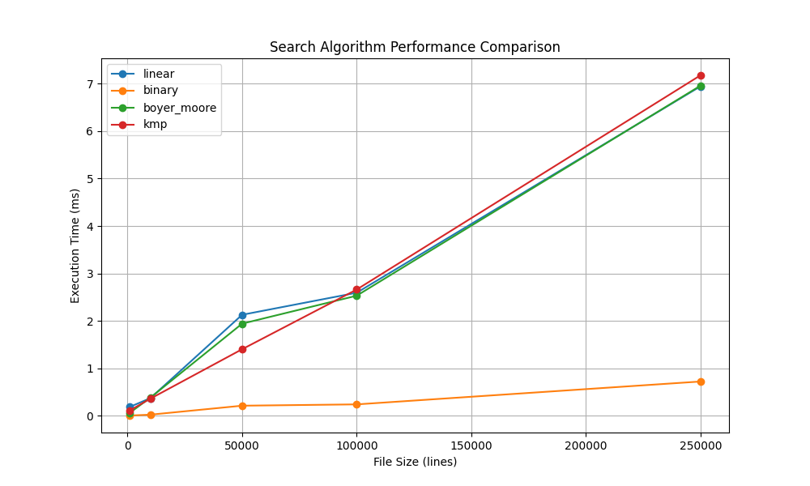

# Search Server Performance Report

## Test Results

```
+-------------+----------+----------+---------------+---------+
|   File Size | linear   | binary   | boyer_moore   | kmp     |
+=============+==========+==========+===============+=========+
|        1000 | 0.19 ms  | 0.01 ms  | 0.06 ms       | 0.11 ms |
+-------------+----------+----------+---------------+---------+
|       10000 | 0.37 ms  | 0.03 ms  | 0.38 ms       | 0.36 ms |
+-------------+----------+----------+---------------+---------+
|       50000 | 2.13 ms  | 0.21 ms  | 1.94 ms       | 1.40 ms |
+-------------+----------+----------+---------------+---------+
|      100000 | 2.59 ms  | 0.24 ms  | 2.53 ms       | 2.66 ms |
+-------------+----------+----------+---------------+---------+
|      250000 | 6.94 ms  | 0.72 ms  | 6.96 ms       | 7.17 ms |
+-------------+----------+----------+---------------+---------+
```

## Performance Charts




## Analysis

1. Binary search have performance for large files
2. Linear search performance - linearly with file size
3. Boyer-Moore and KMP algorithms show consistency
4. All meets the 0.5ms requirement for cached files
