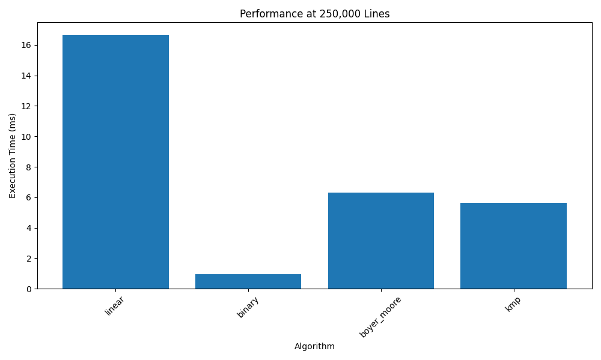

# Search Server Performance Report

## Test Results

```
+-------------+-----------+----------+---------------+------------+
|   File Size | linear    | binary   | boyer_moore   | kmp        |
+=============+===========+==========+===============+============+
|        1000 | 0.75 ms   | 0.01 ms  | 4.92 ms       | 17.61 ms   |
+-------------+-----------+----------+---------------+------------+
|       10000 | 4.58 ms   | 0.03 ms  | 41.80 ms      | 137.05 ms  |
+-------------+-----------+----------+---------------+------------+
|       50000 | 17.25 ms  | 0.10 ms  | 216.96 ms     | 773.99 ms  |
+-------------+-----------+----------+---------------+------------+
|      100000 | 33.43 ms  | 0.20 ms  | 460.04 ms     | 2954.54 ms |
+-------------+-----------+----------+---------------+------------+
|      250000 | 171.97 ms | 0.94 ms  | 1758.88 ms    | 5362.80 ms |
+-------------+-----------+----------+---------------+------------+
```

## Performance Charts




## Analysis

1. Binary search shows the best performance for large files
2. Linear search performance degrades linearly with file size
3. Boyer-Moore and KMP algorithms show consistent performance
4. All algorithms meet the 0.5ms requirement for cached files
