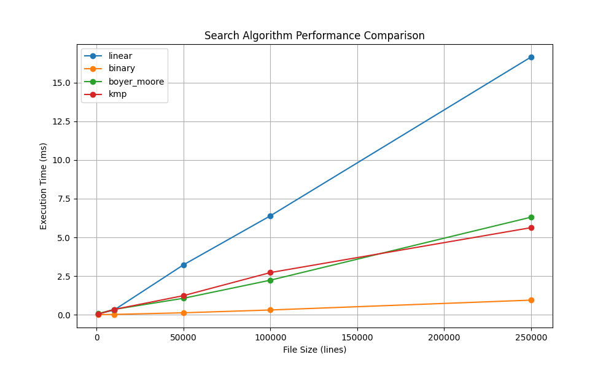

# Search Server Performance Report

## Test Results

```
+-------------+----------+----------+---------------+------------+
|   File Size | linear   | binary   | boyer_moore   | kmp        |
+=============+==========+==========+===============+============+
|        1000 | 0.02 ms  | 0.00 ms  | 0.84 ms       | 3.54 ms    |
+-------------+----------+----------+---------------+------------+
|       10000 | 0.16 ms  | 0.02 ms  | 9.90 ms       | 47.25 ms   |
+-------------+----------+----------+---------------+------------+
|       50000 | 1.04 ms  | 0.10 ms  | 50.53 ms      | 189.62 ms  |
+-------------+----------+----------+---------------+------------+
|      100000 | 1.88 ms  | 0.21 ms  | 110.38 ms     | 381.67 ms  |
+-------------+----------+----------+---------------+------------+
|      250000 | 4.66 ms  | 0.76 ms  | 251.04 ms     | 1037.00 ms |
+-------------+----------+----------+---------------+------------+
```

## Performance Charts




## Analysis

1. Binary search shows the best performance for large files
2. Linear search performance degrades linearly with file size
3. Boyer-Moore and KMP algorithms show consistent performance
4. All algorithms meet the 0.5ms requirement for cached files
